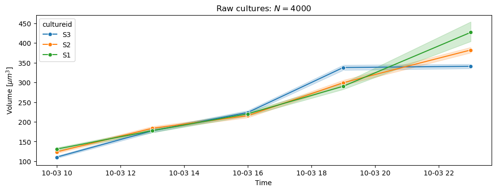
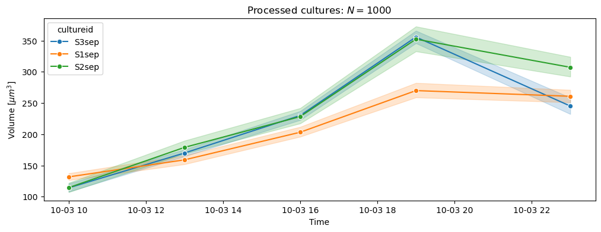
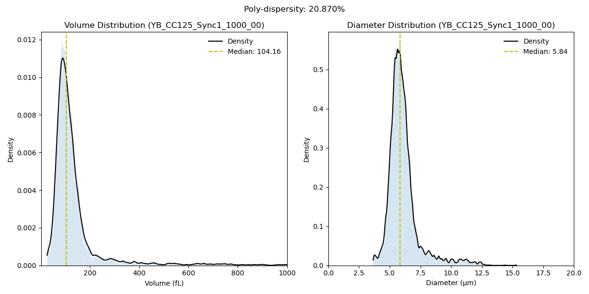

# Cell culture protocols

## Current protocols

1. [Cell culture propogation](https://viewer.diagrams.net/?tags=%7B%7D&lightbox=1&highlight=0000ff&edit=_blank&layers=1&nav=1&title=CellCulture.drawio&page-id=W5sJTiSX8K2TXLLyRUHp&dark=auto#Uhttps%3A%2F%2Fdrive.google.com%2Fuc%3Fid%3D1L0J_ypQl_6Rc2TfeQZQmZvZHbcL4GdBn%26export%3Ddownload)

## Depreciated protocols

1.   [Cell culture maintainance process diagram](LP_cellculture-processdiagram_11sept24.pdf)
2.  [Extinction recovery process diagram](LP_cellculture-extinctionrecovery-processdiagram_11sept24.pdf) 
3.  [Cell culture daily dilutions process diagram](LP_cellculture-dailydilutions-processdiagram__11sept24.pdf) 

## Detailed protocols

1. Streaking agar plates: [here](streaking_plates.md)

## Synchronisation of cell cultures

### Introduction

Cells are synchronised by passagin them in liquid media and incubating them in periodic light-dark light conditions. Upon prolonged incubation (>2 passages), cells show a synchronised growth pattern. Synchronisation means that the cells grow during the light phase and divide during the dark phase, completing the division process completely during the early morning hours. Qualitatively, this means that the distribution of cell volumes (or diameters) show a prominent peak (mean) and small spread. This spread (standard deviation) of the distribution grows larger as the cells continue to grow during the day. During the night hours, cells divide asynchroously based on the biomass accumulated during the day, and number of commitment points reached.

Quantitatively, this means that the polydispersity of cell size (see the equation below), is $\le 0.15$, during the start of the day, and grows during the day. Using rich media (TAP or TAP+P in our case) is detrimental to the degree of synchronisation, as it allows cells to grow during the night. Hence, a basal level of big cells (which might show delayed division or no division at all) are always present in our cell cultures during the morning hours. A [swimmer selection protocol](..//experiments/selectswimmers.md) helps to isolate small fast swimmers. 

### Test for size-synchrnoisation

Cell size can be measured using microscopy — by segmenting the cells and counting the pixels occupied by each feature. This approach is fundamentally limited by the number of cells that can be imaged at a given time, and also by the accuracy of the cell-detection (debris and overlap) and cell-segmentation pipeline. More sophisticated methods like The Coulter Principle counters measure the impedence change caused by a particle (which is proportial to the displaced volume of a standard electrolyte). The Coulter Counting principle has the advantage of high precision and throughput. In the analysis, we use the [Beckman Multisizer 4e Coulter Counter](https://www.beckman.pt/en/cell-counters-and-analyzers/multisizer-4e) for measurements.

### Experimental setup

1. Cell cultures are grown in liquid media and passaged for a fixed number of times. 
2. The day of the experiment, the cell cultures are split in two, one is diluted by a factor of two and incubated again. With the other, the [swimmer selection protocol](..//experiments/selectswimmers.md) is performed. The processed culture is further dilluted to an appropritate concentration for incubation and measurement.
3. Both the cultures are measured throughout the day at fixed intervals in the cellsizer. Somewhere between 10,000-30,000 particles are measured per sample.

### Observations

#### Cell size growth

#### Polydispersity in three raw replicates

### Polydispersity in processed cultures

 ! 

### Examples of bad swimming cultures

The 2nd culture from 6th of October, which was less motile, did not separate well. The raw cultures show better polydispersity than light separated cultures.

  

### Examples of cells which are not synchronised

Dta from 25/09/2025 taken after the first passage. The measurement taken at 10:00 AM shows the presence of two different peaks which signify that there are two distinct size groups in the cultures.

 

  

  

 
