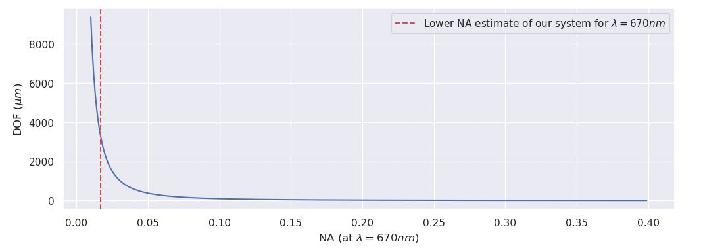

# microfluidics

## Overview of microfluidic devices

| Paper                                                        | Trap size (diameter) | Link                                                         | Snapshot                                                     |
| ------------------------------------------------------------ | -------------------- | ------------------------------------------------------------ | ------------------------------------------------------------ |
| Our Trap                                                     | $2.8mm$              | 0bb8c4d8c8 16 September 2025                            |  |
| [Confinement-induced accumulation and de-mixing of microscopic active-passive mixtures](https://www.nature.com/articles/s41467-022-32520-9) | $400\mu m$           | [Supplementary Movie 5](https://static-content.springer.com/esm/art%3A10.1038%2Fs41467-022-32520-9/MediaObjects/41467_2022_32520_MOESM8_ESM.mov) |  |
| [Microalgae Scatter off Solid Surfaces by Hydrodynamic and Contact Forces](https://journals.aps.org/prl/abstract/10.1103/PhysRevLett.115.258102#supplemental) | Not relavant         | [WT_random_2.mp4](https://journals.aps.org/prl/supplemental/10.1103/PhysRevLett.115.258102/WT_random_2.mp4) Cell, PDMS pillar, and dust speak. |  |
| [Phenotyping single-cell motility in microfluidic confinement](https://elifesciences.org/articles/76519#s4) | $200 \mu m$          | [Video 2](https://static-movie-usa.glencoesoftware.com/mp4/10.7554/931/299aa14b5aa45835b81556c85f8ee5c6ce8a9206/elife-76519-video2.mp4) |  |
| [Nongenetic individuality, changeability, and inheritance in bacterial behavior](https://www.pnas.org/doi/10.1073/pnas.2023322118?url_ver=Z39.88-2003) | $200 \mu m$          | [Movie S1](https://www.pnas.org/doi/10.1073/pnas.2023322118?url_ver=Z39.88-2003#sm01) |  |
| [Nongenetic individuality, changeability, and inheritance in bacterial behavior](https://www.pnas.org/doi/full/10.1073/pnas.2023322118) | 5mm                  | [Supplemenary movie](https://www.pnas.org/doi/suppl/10.1073/pnas.1308282110/suppl_file/sm01.wmv) |  |
| [Short-term memory effects in the phototactic behavior of microalgae](http://pubs.rsc.org/en/content/articlelanding/2024/sm/d3sm01628e) | $200-500 \mu m$      | [Figure 1](https://pubs.rsc.org/image/article/2024/sm/d3sm01628e/d3sm01628e-f1_hi-res.gif) |  |
| [Curvature-Guided Motility of Microalgae in Geometric Confinement](https://journals.aps.org/prl/abstract/10.1103/PhysRevLett.120.068002#supplemental) | $100 \mu m$          | [Supplementary movie](https://journals.aps.org/prl/supplemental/10.1103/PhysRevLett.120.068002/Ostapenko_2017_Supplementary_Movie.mp4) |  |
| [Interplay of surface interaction and magnetic torque in single-cell motion of magnetotactic bacteria in microfluidic confinement](https://elifesciences.org/articles/71527) | $90 \mu m$           | [Video2](https://elifesciences.org/download/aHR0cHM6Ly9zdGF0aWMtbW92aWUtdXNhLmdsZW5jb2Vzb2Z0d2FyZS5jb20vbXA0LzEwLjc1NTQvMjA1LzY1OTkwYTE4Yzk5ZDg0OWRkZTNlZjk4YWM2ZTdlZGI4OTRmZTc4ODQvZWxpZmUtNzE1MjctdmlkZW8yLm1wNA--/elife-71527-video2.mp4?_hash=G1S9JeV%2BDJeKDNT7j5qOi0pN205q3mZlJOIaLH7oofM%3D) |  |

## Cell follow videos to illustrate interactions with dust

| Description      | Exemplar videos                                              |
| ---------------- | ------------------------------------------------------------ |
| Raw (bf680a3e4d) | [video link](assets/bf680a3e4d_2025_08_27__11_13_14__1756289594291549015__split_1_simplesq.mp4) |
| BGS (7a3d98da14) | [video link](assets/vlc-record-2025-09-29-15h34m34s-7a3d98da14_2025_08_21__22_03_46__1755810226372969833__split_66__15006frames.mp4-.mp4) |
| BGS (7a3d98da14) | [video link](/Users/byatharth/code/Trappy-Scopes/protocols/microfluidics/assets/vlc-record-2025-09-29-15h37m02s-7a3d98da14_2025_08_21__22_03_46__1755810226372969833__split_66__15006frames.mp4-.mp4) |

## Comparing trap area vs the outside

+ **Microscopy**: Imaged on M1 with standard red light conditions (0.45, 0, 0) and no fluid.
+ **Fabrication**: fresh devices made with:
	1. Circular Scotch Tape
	2. Clean glass stored for a long time.
	3. Only PDMS washed with isopropyl alcohol
+ **Conclusion:** Trap areas, which are covered with tape while bonding, are generally cleaner than the outside.

EID: 7c55319736

| Device   | Inside the trap                              | Outside                      |
| -------- | -------------------------------------------- | ---------------------------- |
| Device 1 |  |  |
| Device 2 |  |  |
| Device 3 |  |  |

## Effect of scotch tape on dust

+ EID: a4d0ba9e78
+ **Conditions:** Imaged on VWR with 4X magnification and set light conditions with filtered ($0.22\mu m$) deionised water.
+ **Fabrication:** Fresh devices from a single fabrication round.
+ **Conclusion:** Using tape doesn't make a significant difference w.r.t to visible dust.

| With tape                                            | Without tape                                                 |
| ---------------------------------------------------- | ------------------------------------------------------------ |
|  |  |
|  |      |

## Comparision between imaging conditions of M1 and VWR

+ **Aim**: To confirm dust in a seal packed industry standard device. Also to figure out if  we also fociusing on dust outside the glass (glass surface facing the PDMS)?

+ **Note**: I couldn't focus on VWR with the device upright and couldn't observe any dust in the limit where I could focus. I had to focus the chambers from the other side, which changed the focus by a few millimeters and is likely focusing on the outside of the device. Hence, FOV was refocused for chambers on both microscopes along the optical axis.

+ **Observations**: Only 4/11 images have strong features that are similar (these chambers are maked with an asterist sign). In some of them (and possibly others), the dust appears to have moved around. Images from VWR also appear to have parallel lines (probably scratches). Both these observations strongly indicate that on VWR the focus is at the bottom (where dust is likely to move on the outside.)

+ **Conclusion**: Dust on the outside appear to have been moving. Also it is likely that the focal plane is on the outside of the device for the case of the VWR.  This suggests that some of the dust we observe is on the outside for the case of M1 . Dept of field for M1 (and all trappyscopes; and other low magnification and NA systems) is large ($\approx\order{100\mu m}$-$\approx\order{1000\mu m}$). This means that  low NA and low magnification systems (Trappy-Scopes and others; refer to big chambers in the literature review comparison) also image spots that are actually dust speaks on the outside.

	> ## Estimatation of DOF (Dept of field) of the microscope
	>
	> The depth of field of a microscope can be approximated as:
	> $$
	> dof \approx \frac{n\lambda}{NA^2}
	> $$
	> 
	>
	> Since the dept of field is large, it is evident that we might also catch signals from the outside of the glass slide (the glass slide is $1mm$ in thickness). Dept of focus however — is a different concept and is difficult to approximate. Depth of focus determines: what is properly is in focus (i.e. sharp) and would determine which features are sharp and which features are blurred.
	>

+ EID: 9b400bd83c and 092aae6974

| Chamber id | M1                               | VWR                                      |
| ---------- | -------------------------------- | ---------------------------------------- |
| Port 1*    |        |        |
| 1          |  |  |
| 2*         |  |  |
| 3          |  |  |
| 4          |  |  |
| 5*         |  |  |
| 6          |  |  |
| 7          |  |  |
| 8          |  |        |
| Port 2*    |        |        |

Look at the halo on the walls: [Algae_Escapes.mp4](https://journals.aps.org/prresearch/supplemental/10.1103/PhysRevResearch.4.L022029/Algae_Escapes.mp4)