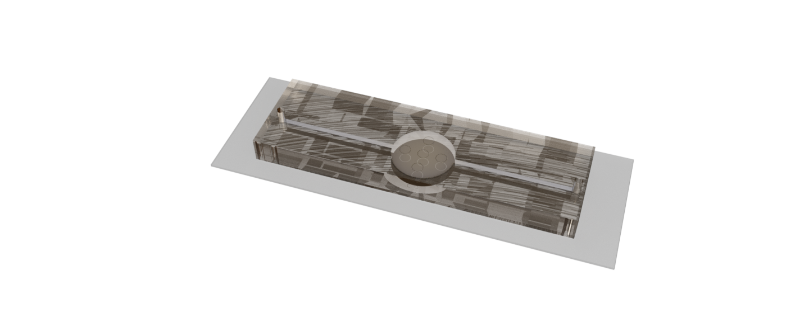

# microfluidics fabrication

Representative microfluidic device ($2mm \times 5$) traps. Without metal ports.

## Associated protocols

1. Glass cleaning: Preparation of piranha and Clean glass slides protocols are separate.
1. PDMS curing: refer below
1. Bonding: Scotch tape preparation has a separate protocol and for general steps refer below.
1. Porting: Metal needle preparation is a separte protocol and for general steps refer below.

## Fabrication Process

1. Mix **35 g of PDMS (Sylgard 184)** with **3.5 g of curing agent**  (10:1 ratio) in a clean plastic cup and stir vigorously. Incomplete mixing leads to uncured PDMS regions in the device.
2. Cover the cup with **perforated aluminum foil** and place it in a **vacuum chamber** to remove air bubbles. Wait for about **45 minutes to 1 hour**, until the PDMS mix becomes clear.
3. Clean the **SU-8 master mold** by spraying with **absolute isopropyl alcohol** and drying with **pressurized nitrogen**. Place the mold on a hot plate at **75 °C** and align a circular resin scaffold to the mold to prepare for pouring the PDMS.
4. Pour the PDMS mixture carefully to avoid introducing bubbles and allow it to cure for **1.5 hours**.
5. After curing, remove the mold and let it cool down. Once detachment of the PDMS is observed around the edges, gently peel it off using tweezers.
6. Cut the individual devices with a sharp blade, making **clean, horizontal cuts**.
7. Using a **0.5 mm microfluidic punch (Rapid-Core Microfluidic Punches)**, cut the port holes in the individual devices with a soft PDMS support underneath. Punch the holes from the **bottom side** (the bonding surface). Use a **biopsy punch with a plunger**, ensuring the PDMS plug is fully removed from both the punch and the device. While withdrawing the punch, **rotate it in one direction** to gently dislodge it from the PDMS.
8. Clean each PDMS device with **absolute isopropyl alcohol** and dry with **pressurized nitrogen**. Place them on a **glass tray** covered with a **vinyl sheet**.
9. Using tweezers, place a **circularly cut piece of Scotch tape** centered over the trap so that it perfectly covers the walls and central trap. This prevents bonding of the walls to the glass slide, which must remain free for proper device operation.
10. Place the PDMS and glass pieces in a **plasma cleaner (Tergeo Plus Plasma Cleaner)** and perform plasma cleaning treatment (**30s**). After cleaning, carefully remove the Scotch tape with tweezers. Gently place the PDMS device at the **center of the glass slide**. Uneven placement can cause poor mounting, sample drift, and failed image acquisition.
11. Gently press the PDMS from the **edges toward the center**. Do **not press the walls**, as this would cause them to bond. This step can be done after all PDMS pieces have been positioned.
12. Place the bonded assemblies on a **hot plate at 75 °C for 1.5 hours** to strengthen the bond.
13. Bend two **metal tubes** on the clean side. Perform the bending in **two stages** to prevent tube closure. The bends must be **smooth, without kinks**.
14. Insert the metal tubes into the PDMS device ports. Place the devices in a **UV curing station** to apply **UV adhesive** (we use [Bondic](https://bondic.shop/en/bondic/) UV glue).
15. Apply the glue in **two stages**: First, apply a small amount of glue to the ports and cure under a **75 W UV lamp** for **2 minutes** to form a stable scaffold layer. Then, apply a larger drop of glue and cure again for **2 minutes**.
16. Store the completed devices in a **3D-printed slide holder**, covered with **aluminum foil**. Keep the stock in the **cleanroom** and transfer to the **lab** as needed.