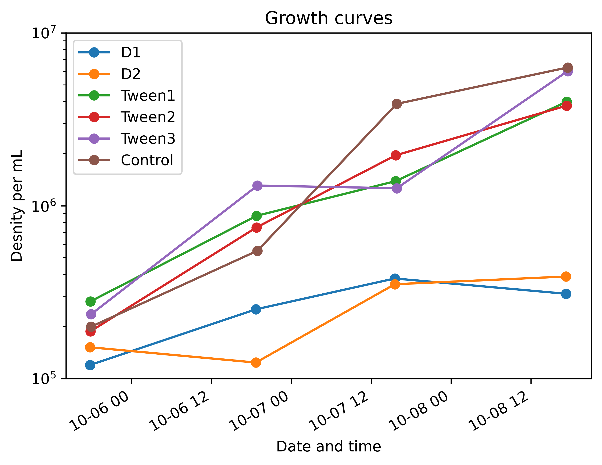

# microfluidics/treatment (passivation)

Treatment or passivation of microfluidics is necesary for bio-compatibility. Passivation improves the surface compatibility of the devices by blocking non-specific interactions that cause addhession.

## BSA (Bovine Serum Albumin)

BSA is an albumin protain that is a common tool in biochemistry. It is used to block non-specific interactions and coats evenly on surfaces.

### Surface coating analysis

[Study on surface properties of PDMS microfluidic chips treated with albumin](https://pmc.ncbi.nlm.nih.gov/articles/PMC2835281/#abstract1)

> "The AFM analysis of the native and the BSA treated PDMS chips showed an increase in the average surface roughness from 0.68 nm to 4.28 nm and also significant heterogeneities of the protein layer. This observation implied that (i) the increased surface roughness offers a higher resistance to the electro-osmotic flow, and (ii) the BSA molecules cover only a part of the PDMS surface and partially shield the fixed electric charge."

### Cleaning BSA treated devices

A dillute Tween20 solution is recommended for cleaning coated devices — [Darwin microfluidics : How to Clean Your Microfluidic Chip: A Comprehensive Guide](https://blog.darwin-microfluidics.com/how-to-clean-your-microfluidic-chip/#Conclusion).

#### Sources

1. [Darwin Microfluidics - Coating in Microfluidics](https://blog.darwin-microfluidics.com/coatings-in-microfluidics-a-review/)
2. [Everything You Need to Know About BSA](https://www.bosterbio.com/blog/post/everything-you-need-to-know-about-bsa)
3. [Reddit labrats : How long do you guys keep your diluted BSA standards (Bradford)?](https://www.reddit.com/r/labrats/comments/113az09/how_long_do_you_guys_keep_your_diluted_bsa/)
4. [C–Trap Cleaning and Passivation Protocol](https://store.lumicks.com/wp-content/uploads/C-Trap-Cleaning-and-Passivation-Protocol.pdf)
5. [Merk: Albumins and Transport Proteins](https://www.sigmaaldrich.com/PT/en/products/cell-culture-and-analysis/cell-culture-supplements-and-reagents/albumins-and-transport-proteins) : also contains purchase links.

## Tween 20

Tween 20 is a bio-compatible, PDMS compatible detergent that is helpful for preventing non-specific adhesion in microfluidic channels. At low concnetrations, it can be added in the cell culture volume to prevent cell adhesion. Tween 20 is non-ionic and does not disrupt most biological activity.It is also compatible with common blocking agents like BSA. It is also soluble in alcohols.

It is in-effective for lysing cells: [Behind the Blot: Everything You Need to Know About Tween 20 ](https://www.bosterbio.com/blog/post/behind-the-blot-everything-you-need-to-know-about-tween-20) states:

> "In cell culture, low doses of Tween 20 (≪0.1%) usually do not harm mammalian cells significantly – indeed, some company certifies certain lots for cell culture use."

Tween 20 is also compatible with TAP media.

Growing cells (CR CC125) with at a low concentration of Tween 20 (0.05% Tween20 in TAPP media) showed a nominal growth rate. It should be noted that the cells formed more pallmoloids near the saturation phase. D1 and D2 represent cells grown in darkness.

### Maintaining stocks

+ Maintaining stocks is relatively simple. Add measured volume to water or media while stirring or mix by shaking. 
+ Maintain 1% Tween 20 stocks. Use 0.01-0.05% for motility experiments and use 0.5% for cleaning mirofluidics.

### Reading material

1. [Effects of Tween 20 addition on electrokinetic transport in a polydimethylsiloxane microchannel](https://pmc.ncbi.nlm.nih.gov/articles/PMC11707311/)
2. [Antioxidant activity of Tween-20 and Tween-80 evaluated through different in-vitro tests](https://pubmed.ncbi.nlm.nih.gov/25556861/)
3. [Behind the Blot: Everything You Need to Know About Tween 20](https://www.bosterbio.com/blog/post/behind-the-blot-everything-you-need-to-know-about-tween-20)

## Cleaning of microfluidics

Cleaning procedure included the following passages using a multiplexed pumping system [Trappy-Scopes/plumbing](https://github.com/Trappy-Scopes/plumbing):

1. Pass ~5mL of $ddH_2O$.
2. Pass ~5mL of 0.5% Tween20 in $ddH_2O$.
3. Pass ~5mL of $ddH_2O$.
4. Pass ~5mL of 20% Ethanol.
5. Pass ~5mL of $ddH_2O$.
6. Pass filtered air until dry
7. Heat sterlize overnight at 110ºC.

### Reading material

1. [Darwin microfluidics : How to Clean Your Microfluidic Chip: A Comprehensive Guide](https://blog.darwin-microfluidics.com/how-to-clean-your-microfluidic-chip/#Conclusion)
2. [Efficient cleaning of a microfluidic chip](https://blogs.rsc.org/chipsandtips/2016/02/08/efficient-cleaning-of-a-microfluidic-chip/?doing_wp_cron=1765324150.4516239166259765625000)
3. [A simple trick to open up clogged microfluidic chip](https://blogs.rsc.org/chipsandtips/2013/07/18/a-simple-trick-to-open-up-clogged-microfluidic-chip/)

