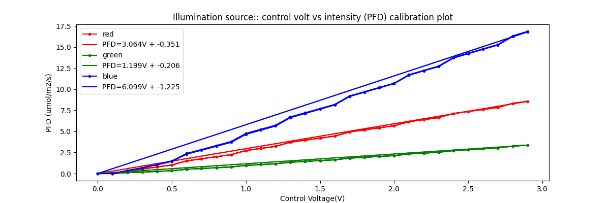
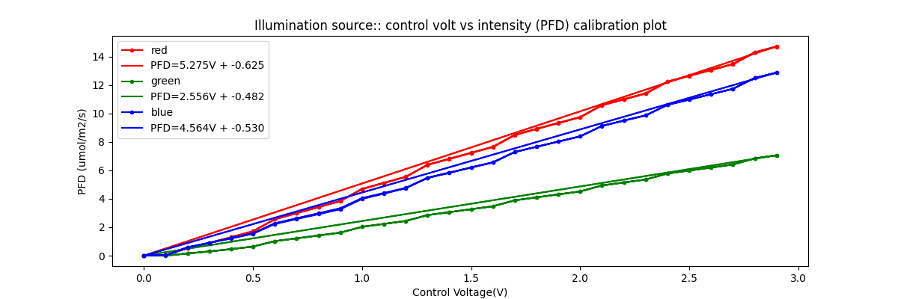
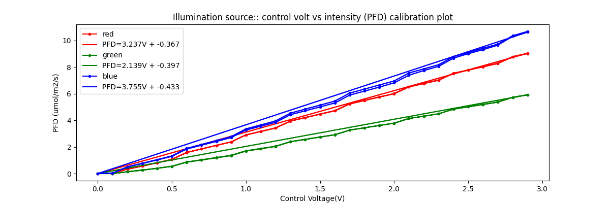
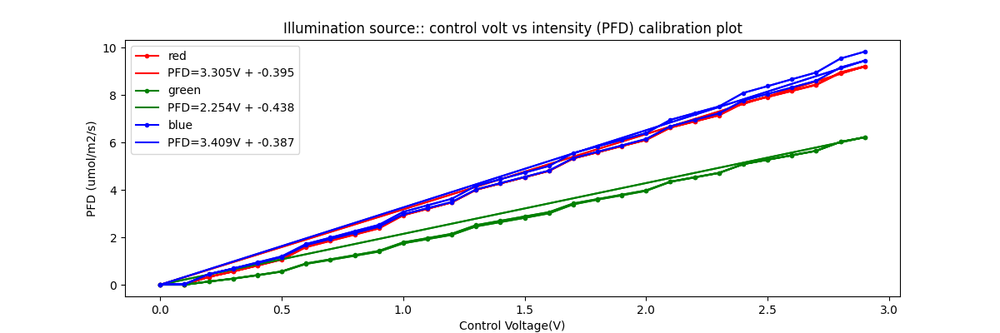
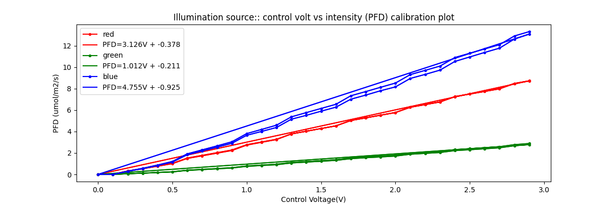
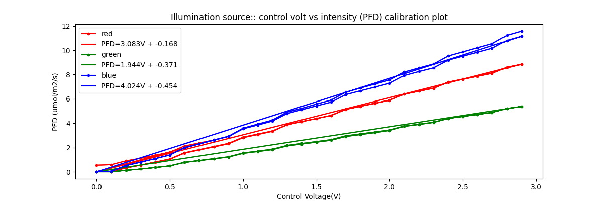
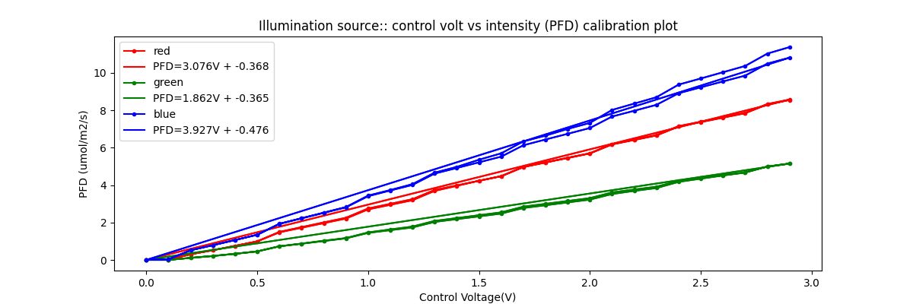
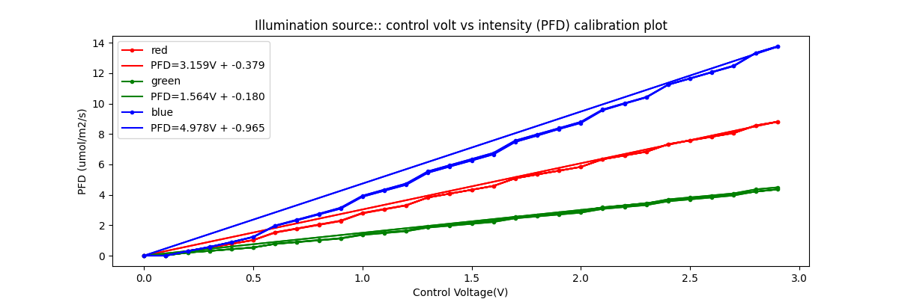

# Light calibration

Calibration of light source was performed using the [TrappyScopes/spectrum](https://github.com/Trappy-Scopes/spectrum) using the TSL2591 high-dynamic range light sensor. The measurements yield calibration curves like the one described below.

### Reading Material

1. [jfischer/micropython-tsl2591](https://github.com/jfischer/micropython-tsl2591/tree/master)
2. [Machine Learning for Light Sensor Calibration](https://www.mdpi.com/1424-8220/21/18/6259)
3. [Design and development of a low-cost glazing measurement system](https://www.sciencedirect.com/science/article/pii/S221501612030248X)

# Appendix

### Data from 18/November/2025

### M1

### M2

### M3

### M4

### M5

### M6

### M7

### M8

